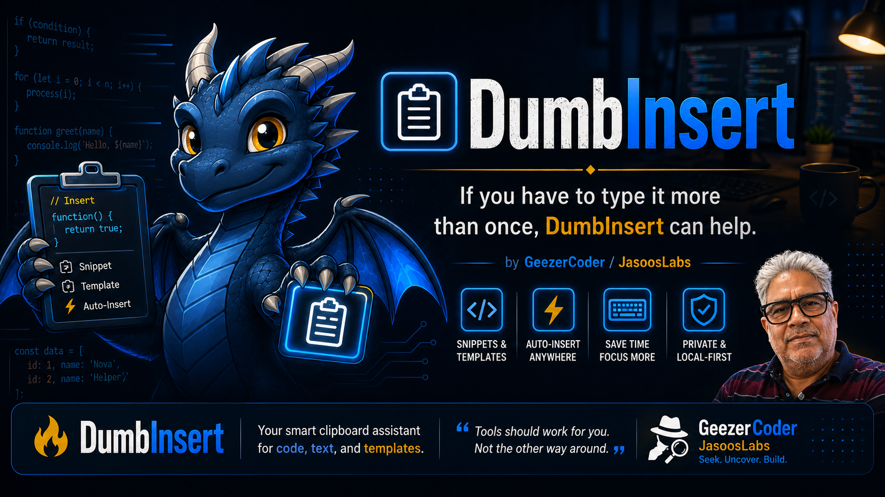

# DumbInsert v1.0

DumbInsert is a small Windows helper for repeated text.

## Recommended download

`DumbInsert-v1.0-GeezerCoder-standalone-win-x64.zip`

This includes the needed .NET runtime. Unzip and run `DumbInsert.exe`.

## Smaller download

`DumbInsert-v1.0-GeezerCoder-framework-dependent-win-x64.zip`

This requires Microsoft .NET 8 Desktop Runtime x64 to already be installed.

## Notes

- Freeware, not open source.
- Local Windows utility.
- Data is stored under `%APPDATA%\DumbInsert`.
- Protected rows are not a password manager.
- Provided as-is, without warranty.

## Included docs

- `README.md`
- `LICENSE.txt`
- `CHANGELOG.md`
